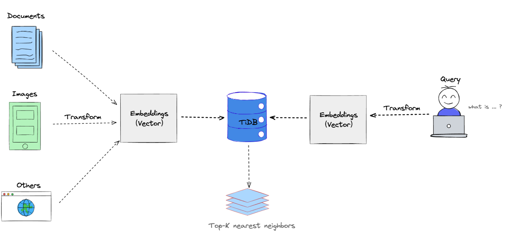

# EinoRag

EinoRag is a Retrieval-Augmented Generation (RAG) API SDK built on top of ByteDance's Eino framework. It helps developers easily integrate vector retrieval and generative AI capabilities. The project is written in Go 1.22+, supports Google Gemini Embedding, and features flexible configuration and easy extensibility.

---

## Directory Structure

```
/Eino-rag      # Core RAG functionality (vector upload, retrieval, etc.)
/internal
  ├─ config    # Configuration loading and management (viper, yaml parsing, etc.)
  ├─ embadding # Embedding/vectorization logic
  └─ rag       # RAG business logic implementation
/pkg
  ├─ wokerpool # General-purpose goroutine pool
  └─ logger    # Logging component
main.go        # Example entry point demonstrating upload and retrieval
README.md      # Project documentation
```

---

## Quick Start

1. **Clone the project and enter the directory**
   ```bash
   git clone https://github.com/leebrouse/EinoRag.git
   cd EinoRag
   ```

2. **Prepare the environment**
   - Install Go 1.22 or above
   - Set your Gemini API Key
     ```bash
     export GOOGLE_API_KEY="<your_API_KEY>"
     ```
   - Edit `internal/config/global.yaml` to configure the embedding model
     ```yaml
     gemini:
       embedder: gemini-embedding-001
     ```

3. **Run the example**
   ```bash
   go run main.go
   ```
   The example in main.go uploads a PDF document and performs content retrieval via the vector database.

4. **Run integration tests**
   ```bash
   go test ./test -run TestGeminiEmbedder_Real -v
   ```

---

## Main Features

- Supports PDF document vectorization and retrieval
- Encapsulates Gemini Embedding API
- Flexible configuration management (environment variables and YAML)
- Built-in goroutine pool and logging modules for easy extension

---

## Architecture



The diagram above illustrates the core architecture of EinoRag, including data upload, vectorization, storage, and retrieval processes, helping developers quickly understand the overall implementation.

---

## FAQ

- **Configuration priority:** If viper fails to read environment variables, explicitly configure in global.yaml
- **Authentication failure:** Ensure GOOGLE_API_KEY is correctly exported and has the required permissions

---

## References

- [EinoRag GitHub Repository](https://github.com/leebrouse/EinoRag)
- [Eino Document](https://www.cloudwego.io/zh/docs/eino/quick_start/)
- [Google Gemini Embedding document](https://ai.google.dev/gemini-api/docs/migrate-to-cloud)

---

For detailed API or development documentation, please refer to the source code and comments in each subdirectory.
